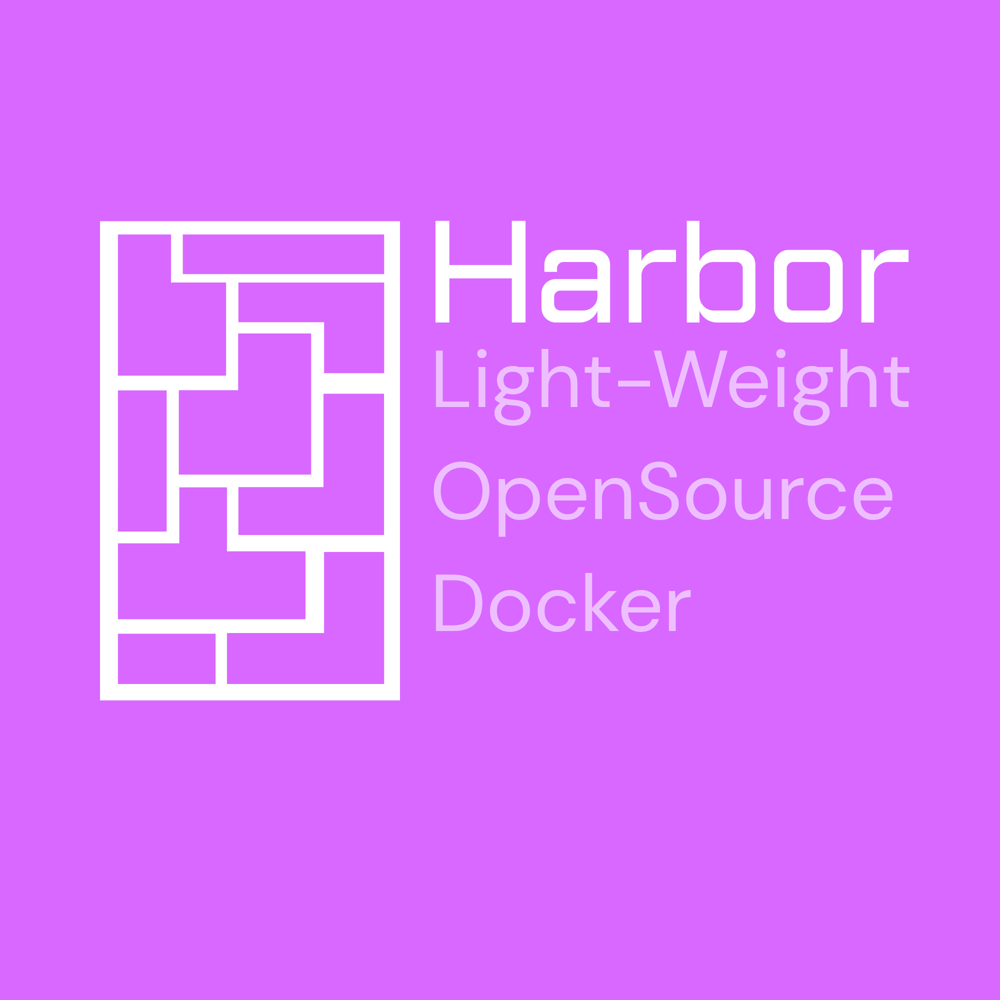

<p align="center">
  
</p>

<h1 align="center">Harbor</h1>

<p align="center">
  Uma CLI open source leve para empacotar projetos, gerar metadados, checar compatibilidade, validar integridade e exportar containers criptografados.
</p>

<p align="center">
  
  
  
</p>

---

## O que é o Harbor?

Harbor é uma suíte de terminal que transforma um projeto em uma pasta portátil no estilo container.

Ele escaneia a árvore do projeto, detecta stacks conhecidas, gera metadados, copia o código para uma área limpa `Code/`, guarda informações em `Info/`, cria hashes SHA-256 recursivos para integridade e pode exportar tudo como um arquivo `.bcb` criptografado.

Ele não é Docker. Ele é mais próximo de um empacotador, verificador e assistente de compatibilidade para projetos.

## Recursos

- CLI interativa com `help`, `wrapper`, `acess`, `test`, `verify` e `uphash`.
- Leitura da árvore do projeto com suporte a `.harbignore`.
- Detecção de stacks/runtimes como Python, Node.js, Go, Rust, Java, Docker, React, Vue e mais.
- Layout de container Harbor com `Code/` e `Info/`.
- Header de metadados com nome, versão, sistema operacional, arquitetura, stacks e árvore do projeto.
- Hashes `.hash.txt` recursivos para validação de integridade.
- Exportação opcional para `.bcb` criptografado.
- Restauração de arquivos `.bcb` para pastas comuns.

## Instalação

```bash
git clone <repo-url>
cd Harbor
python -m pip install pathspec
```

Harbor usa a biblioteca padrão do Python e apenas uma dependência externa: `pathspec`.

## Como rodar

```bash
python main.py
```

Depois use o prompt interativo:

```text
Harbor > help
```

## Comandos

```text
help                  Mostra os comandos disponíveis
exit                  Sai do Harbor
clear                 Limpa o terminal

wrapper <path>        Cria um container Harbor a partir de um projeto
acess <file> <out>    Restaura um container .bcb criptografado
test <path>           Checa compatibilidade de OS, arquitetura e runtime
verify <path>         Verifica os hashes do container
uphash <path>         Recalcula os hashes do container
```

`wrapper <path>` usa o diretório atual quando nenhum caminho é informado.

## Saída do Container

Para um projeto chamado `MyApp`, o Harbor cria:

```text
MyApp-[HARBOR]/
├── Code/             arquivos copiados do projeto
├── Info/             header.json, tree.json, .harbignore
└── .hash.txt         hash de integridade raiz
```

Se a criptografia for ativada, o Harbor também cria:

```text
MyApp-[HARBOR]_encrypted.bcb
```

## Regras de Ignore

Adicione um arquivo `.harbignore` na raiz do projeto para excluir arquivos ou pastas do container.

Harbor lê esse arquivo com regras no estilo gitwildmatch usando `pathspec`.

Exemplo:

```gitignore
.git/
__pycache__/
node_modules/
*.log
```

## Nota de Segurança

Harbor inclui uma camada de criptografia customizada e educacional para arquivos `.bcb`. Use para empacotamento e compartilhamento controlado de projetos, não como substituto de criptografia auditada para produção.

Já estamos trabalhando para substituir pelo AES.

## Estrutura do Projeto

```text
.
├── main.py                           CLI interativa do Harbor
├── imgs/                             artes do projeto
└── ContainerStuff/
    ├── wrapper.py                    cria, hasheia, verifica e criptografa containers
    ├── acess.py                      restaura containers criptografados
    ├── test.py                       checagens de compatibilidade
    ├── dirtrain.py                   scan da árvore e detecção de stacks
    ├── header.py                     geração do header de metadados
    ├── stack.py                      definições de stacks conhecidas
    └── Obsidian/BaseSystem/
        ├── crypto.py                 funções de cifra do Harbor
        ├── hasher.py                 helpers de hash
        └── main.py                   fluxo base de criptografia
```

## Licença

Licença MIT.

Criado e mantido por ByKurebo.
