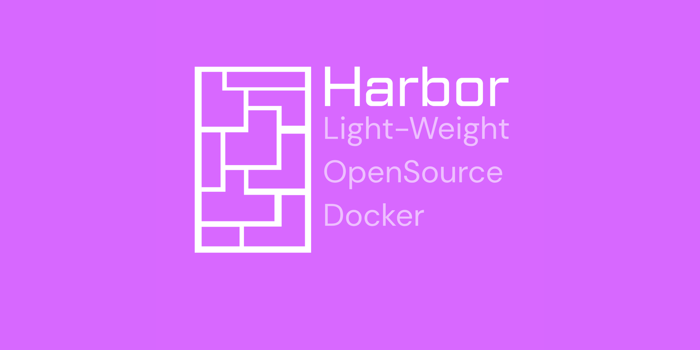

<p align="center">
  
</p>

<h1 align="center">Harbor</h1>

<p align="center">
  Uma CLI open source leve para empacotar projetos em containers Harbor portáteis com metadados, checagem de compatibilidade, hashes de integridade e exportação criptografada opcional.
</p>

<p align="center">
  
  
  
</p>

---

## O que é o Harbor?

Harbor transforma uma pasta de projeto em um pacote portátil no estilo container.

Ele escaneia a árvore do projeto, detecta stacks conhecidas, gera metadados, copia o código para uma área limpa `Code/`, guarda arquivos de raiz em `Info/`, cria hashes SHA-256 recursivos, compacta o resultado como `.harb` e também pode criar uma exportação `.bcb` criptografada por senha.

Harbor não é Docker. Ele é mais próximo de um empacotador, verificador e assistente de compatibilidade para projetos.

## Recursos

- `wrapper`: cria um container Harbor a partir de um diretório de projeto.
- `inflate`: extrai um container `.harb`.
- `restore`: descriptografa e extrai uma exportação `.bcb`.
- `verify`: valida a árvore recursiva de integridade `.hash.txt`.
- `uphash`: recalcula os hashes do container após mudanças intencionais.
- `compatibility`: checa o sistema operacional, a arquitetura e os runtimes atuais contra os metadados do container.
- Suporte a `.harbignore` com regras no estilo gitwildmatch.
- Detecção de stacks como Python, Node.js, Go, Rust, Java, Docker, React, Vue e mais.

## Instalação

```bash
git clone https://github.com/kauanmezavila/harbor.git
cd Harbor
python -m pip install pathspec cryptography
```

## Uso

```bash
python main.py <comando> <args>
```

```text
Comandos:
  wrapper <path>                            Cria um container Harbor
  inflate <file.harb> [--out <directory>]   Extrai um container .harb
  restore <file.bcb> --password <password>  Restaura uma exportação .bcb criptografada
  verify <path>                             Verifica os hashes do container
  uphash <path>                             Recalcula os hashes do container
  compatibility <path>                      Checa a compatibilidade do container
```

Exemplos:

```bash
python main.py wrapper ./MyApp
python main.py inflate "./MyApp-Any-Any-[HARBOR].harb" --out ./restored
python main.py restore "./MyApp-Any-Any-[HARBOR]_encrypted.bcb" --password "secret" --out ./restored
python main.py verify "./MyApp-Any-Any-[HARBOR]"
python main.py compatibility "./MyApp-Any-Any-[HARBOR]"
```

## Saída do Container

Para um projeto chamado `MyApp`, o Harbor cria:

```text
MyApp-Any-Any-[HARBOR]/
├── Code/             arquivos copiados do projeto
├── Info/             header.json, tree.json, .harbignore
└── .hash.txt         hash de integridade raiz
```

Ele também cria:

```text
MyApp-Any-Any-[HARBOR].harb
```

Se a criptografia for ativada, o Harbor cria:

```text
MyApp-Any-Any-[HARBOR]_encrypted.bcb
```

A parte `Any-Any` muda quando você define arquiteturas ou sistemas operacionais específicos durante o empacotamento.

## Regras de Ignore

Adicione um arquivo `.harbignore` na raiz do projeto para excluir arquivos ou pastas do container.

Exemplo:

```gitignore
.git/
__pycache__/
node_modules/
*.log
```

## Nota de Segurança

Exportações `.bcb` criptografadas usam AES-GCM através do pacote `cryptography`. Use para empacotamento e compartilhamento controlado, não como substituto de um processo de segurança completo e auditado para produção.

## Estrutura do Projeto

```text
.
├── main.py                           dispatcher de comandos do Harbor
├── imgs/                             artes do projeto
└── ContainerStuff/
    ├── access.py                     restaura exportações .bcb criptografadas
    ├── compatibility.py              checagens de OS, arquitetura e runtimes
    ├── dirtrain.py                   scan da árvore e detecção de stacks
    ├── header.py                     geração do header de metadados
    ├── stack.py                      definições de stacks conhecidas
    ├── wrapper.py                    fluxo de wrapper, compressão .harb e inflate
    ├── WrapperStuff/
    │   ├── containerflux.py          copia arquivos e aplica .harbignore
    │   ├── hashflux.py               criação e atualização de hashes
    │   └── verifyflux.py             verificação de hashes
    └── Obsidian/BaseSystem/
        ├── crypto.py                 funções de cifra do Harbor
        └── main.py                   fluxo base de criptografia
```

## Licença

Licença MIT.

Criado e mantido por ByKurebo.
